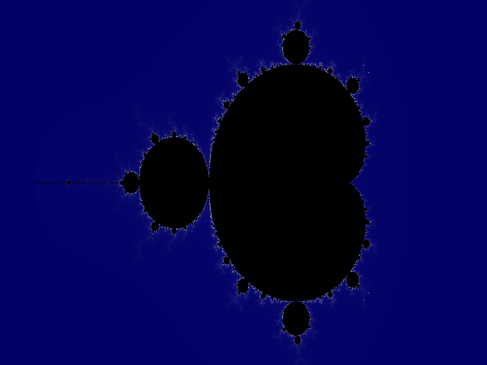
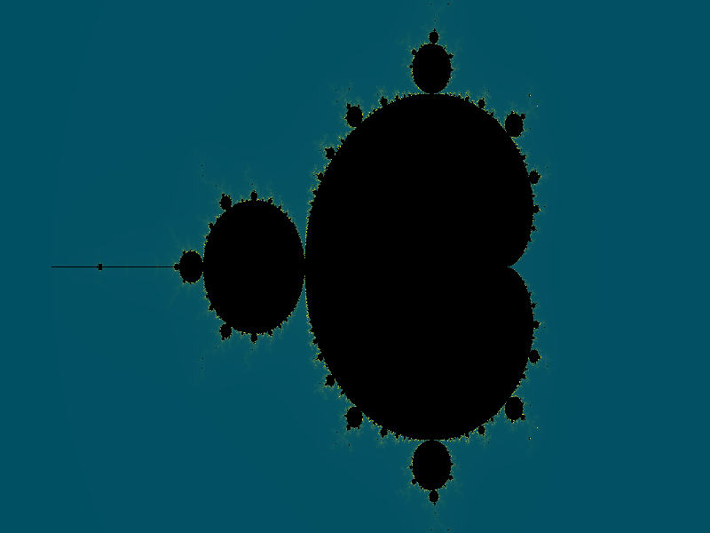
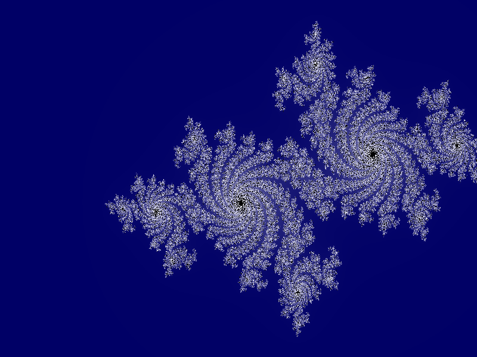
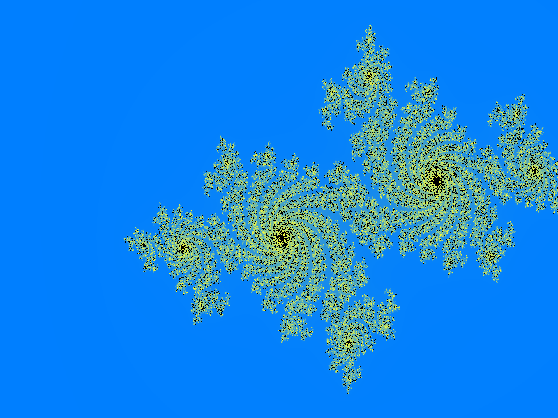

## **OpenCL Fractal Renderer — Overview**

This project is a GPU-accelerated Mandelbrot/Julia fractal renderer written in C++17 with OpenCL. It:

- Computes **Mandelbrot** and **Julia** sets on the GPU.
- Exposes a rich **CLI** for controlling resolution, iterations, center/zoom, palette, and work-group size.
- Saves images as **PPM** or **PNG** (cross-platform via `stb_image_write`).
- Demonstrates both **basic** and **advanced** OpenCL concepts (device discovery, kernel compilation, events/profiling, work-group tuning).

The code is organized for clarity and to align with the assignment rubric.

---

## **1. Architectural Overview**

### **1.1 High-Level Architecture**

A simple, clean three-layer architecture:

```
+-----------------------------+
|        CLI Interface        |
+-----------------------------+
|  Renderer Engine (Host)     |
|  - Device selection         |
|  - Kernel compilation       |
|  - Memory management        |
|  - Kernel dispatching       |
+-----------------------------+
|     OpenCL Kernels (GPU)    |
|     - Mandelbrot/Julia kernel   |
|     - (Optional) color kernel   |
|     - (Optional) tiling         |
+-----------------------------+
|            Output           |
|   (PPM/PNG via stb)        |
+-----------------------------+
```

---

### **1.2 Software Patterns Used**

### **(1) Strategy Pattern — Fractal Type**

The renderer supports two fractal types: Mandelbrot and Julia, implemented via a `FractalStrategy` interface with concrete `MandelbrotStrategy` and `JuliaStrategy`.  
The strategy is selected via:

```text
--type mandelbrot
--type julia
```

### **(2) Builder Pattern — Render Configuration**

Runtime configuration is built via a `RenderConfig` builder:

```cpp
RenderConfig cfg = RenderConfig::builder()
    .width(4096)
    .height(4096)
    .maxIterations(1000)
    .center(-0.5, 0.0)
    .zoom(1.35)
    .palette("sunset")
    .build();
```

### **(3) Pipeline Pattern (Mini Data Pipeline)**

The current implementation uses a simple host/GPU pipeline:

1. **Fractal iteration calculation** (OpenCL kernel) → iteration buffer.
2. **Color mapping** (host-side, multiple palettes) → RGB image data.
3. **Write to disk** (PPM or PNG).

This structure keeps responsibilities clear and can be extended with an additional GPU color kernel later.

### **(4) RAII / Resource Management Pattern**

Encapsulate:

* Context
* Command queue
* Memory objects

into C++ classes with destructors to avoid leaks.

---

## **2. Detailed Components**

### **2.1 Host-Side Components**

#### **2.1.1 Device Manager**

Responsibilities:

* Enumerate devices
* Select GPU by default; fall back to CPU
* Query capabilities (max work-group size, image support)
* Print device diagnostics

---

#### **2.1.2 Kernel Manager**

* Loads `.cl` kernel files
* Builds programs
* Provides a simple API to fetch kernels
* Prints build logs on error

---

#### **2.1.3 Memory Manager**

Handles all:

* Buffers
* Image2D objects
* Sub-buffers for tile rendering
* Local memory block sizes

---

#### **2.1.4 Renderer**

Implements the pipeline:

1. Compute fractal iterations
2. Apply color palette
3. Output image

Supports command-line arguments (see detailed CLI below).

---

#### **2.1.5 Output Writer**

`OutputWriter`:

- Maps iteration counts to RGB using host-side palettes (`default`, `sunset`, `neon`) based on `--palette`.
- Writes:
  - **PPM** directly.
  - **PNG** using `stb_image_write.h` (cross-platform, Windows/Linux/macOS).

---

### **2.2 Kernel Design**

#### **2.2.1 Fractal Iteration Kernel (Mandelbrot + Julia)**

Inputs:

* Image size
* Zoom
* Center
* Max iterations
* Complex constant (Julia)

Outputs:

* Iteration count per pixel

Current optimizations:

- Configurable work-group sizes via `--local-size-x` / `--local-size-y`.
- OpenCL **profiling events** around the kernel, reporting execution time in milliseconds.

Planned extensions (tracked in `milestones.md`):

- A separate **color-mapping kernel** that reads iteration counts and a palette buffer on the GPU.
- Optional tiling and local-memory optimizations for very large images.

---

## **3. Building and Running**

### **3.1 Build Script (`scripts/build.sh`)**

- Compiles the C++ host code with:
  - `-std=c++17 -O2 -Wextra`
  - Includes from `include/`
  - Links against the macOS OpenCL framework.

Usage:

```bash
./scripts/build.sh
```

### **3.2 Run Script (`scripts/run.sh`)**

The run script builds if necessary, then forwards all CLI arguments to the binary:

```bash
./scripts/run.sh [options...]
```

Examples:

```bash
# Basic Mandelbrot PNG (saved to images/mandel.png)
./scripts/run.sh --width 800 --height 600 --iterations 500 \
  --type mandelbrot --palette default --output mandel.png

# Julia set with classic c = -0.7 + 0.27015i and neon palette (saved to images/julia_neon.png)
./scripts/run.sh --width 800 --height 600 --iterations 500 \
  --type julia --julia-real -0.7 --julia-imag 0.27015 \
  --palette neon --output julia_neon.png

# Work-group tuning example (timing printed as [Fractal kernel] X ms, saved to images/mandel_16x16.png)
./scripts/run.sh --width 1920 --height 1080 --iterations 1000 \
  --type mandelbrot --palette default \
  --local-size-x 16 --local-size-y 16 --output mandel_16x16.png
```

---

## **3.3 Gallery**

Example renders showcasing different fractal types and color palettes:

### Mandelbrot Set

<div align="center">

**Default Palette**


**Sunset Palette**


</div>

### Julia Set

<div align="center">

**Default Palette**


**Neon Palette**


</div>

---

## **4. Command-Line Options**

Supported flags:

- `--type mandelbrot|julia`  
  Fractal type (default: `mandelbrot`).

- `--width <int>` / `--height <int>`  
  Image resolution in pixels (default: `1920x1080`).

- `--iterations <int>`  
  Maximum iterations per pixel (default: `1000`).

- `--center <real> <imag>`  
  Complex plane center (default: `-0.5 0.0`).

- `--zoom <real>`  
  Zoom factor (default: `1.0`).

- `--julia-real <real>` / `--julia-imag <real>`  
  Julia constant \(c = \text{real} + i \cdot \text{imag}\) (defaults: `-0.7`, `0.27015`).

- `--palette <name>`  
  Color palette: `default`, `sunset`, or `neon` (default: `default`).

- `--output <file>`  
  Output image path.  
  - `.ppm` → PPM written directly.  
  - `.png` → PNG written using `stb_image_write` (cross-platform).  
  - Files are written to the `images/` directory by default (unless path contains directory separators or is absolute).

- `--local-size-x <int>` / `--local-size-y <int>`  
  Optional local work-group size (0 or omit → let OpenCL choose).

---

## **5. Repository Structure**

```
OpenCL Fractal Renderer (simplified):
│
├── src/
│   ├── main.cpp
│   ├── device_manager.cpp
│   ├── kernel_manager.cpp
│   ├── memory_manager.cpp
│   ├── renderer.cpp
│   ├── fractal_strategy.cpp
│   └── output_writer.cpp
│
├── include/
│   ├── config.h
│   ├── device_manager.h
│   ├── kernel_manager.h
│   ├── memory_manager.h
│   ├── renderer.h
│   └── fractal_strategy.h
│
├── kernels/
│   └── mandelbrot.cl        # unified Mandelbrot + Julia kernel
│
├── scripts/
│   ├── build.sh
│   └── run.sh
│
├── vendor/
│   └── stb_image_write.h    # stb library for cross-platform PNG output
│
├── images/                  # Generated fractal images (PNG/PPM)
│
├── performance_notes.md     # work-group size experiments and timing notes
├── milestones.md            # development milestones and rubric alignment
└── README.md
```